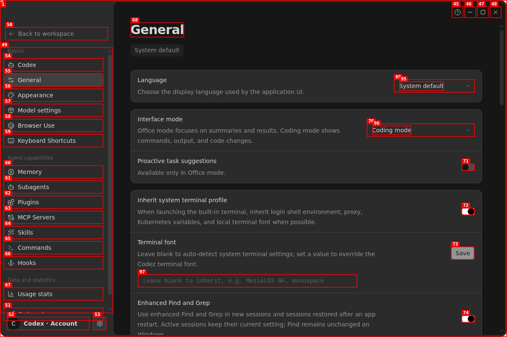
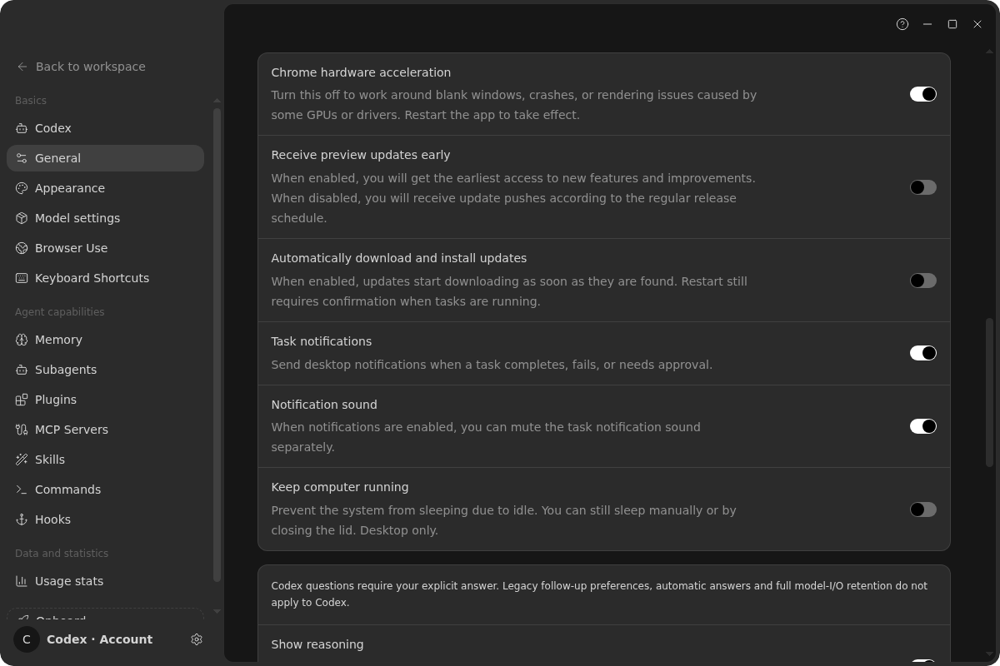
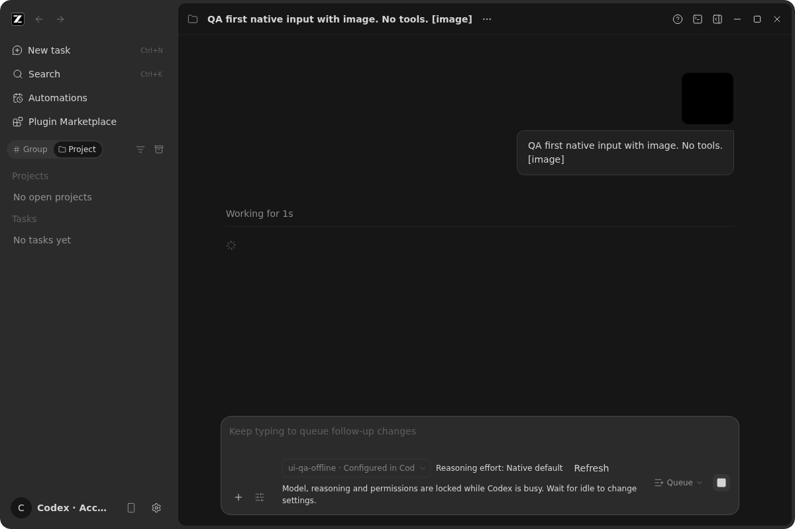

# Codex fork 适配审查与可复现 GUI 验收（2026-10-03）

本报告针对当前 Codez fork、仓库内固定原生 Codex 二进制与只读的
`/root/workspace/codex` 源码。参考树本身有未归属改动，未参与编译或修改。
目标是发现并修复有证据的适配缺口；它不是对任意账号、全部平台与每个
GUI 状态组合的“完美适配”证明。原始交互步骤位于被忽略的
`.tmp/codex-dogfood-20261002/report.md`；录屏在本容器因 ffmpeg
`Broken pipe` 失败，未将截图冒充录屏。

## 已确认发现与决策

| 优先级                 | 事实或待定风险                                                                                                                                                                                                                                                                                                                             | 处理及验收边界                                                                                                                                                                                                                 |
| ---------------------- | ------------------------------------------------------------------------------------------------------------------------------------------------------------------------------------------------------------------------------------------------------------------------------------------------------------------------------------------ | ------------------------------------------------------------------------------------------------------------------------------------------------------------------------------------------------------------------------------ |
| 高，已修               | Host 在 `packages/services/src/node.ts` 已按实际 command resolver 选定原生 Codex，但 Root 启动仍做旧 Provider 家族迁移、View 订阅和 OAuth 恢复；连接丢失观察者还会调用旧 `getView`。旧设置甚至可能在 Codex 首启写入 providerFamilyDomain。真实隔离 Host 的旧审查日志曾出现 Provider 刷新失败；**尚不能证明**它是 Electron 崩溃的唯一原因。 | 复用现有 `ISystemService.info` 报告 Host 选型，Root 在结果明确前不启动旧链路。原生跳过旧配置/账号，显式 legacy/custom/Web 保留原行为。旧 Host/读取失败按旧行为退回，并记诊断。Host 与 UI 用同一事实，没有另一份模型/账号缓存。 |
| 中，已修               | 真实 Electron 的 General 页面中，“继承系统终端 Profile”、通知/声音、自动归档等开关及语言/归档 Select 在无障碍树中缺少名称。                                                                                                                                                                                                                | 用现成中英文 setting key 为控件命名，不改保存归属；隔离 Electron 检查名称、键盘改变与恢复，浏览器共享组件检查 Windows 专有控件。                                                                                               |
| 高，已修（审查补充）   | 只跳过旧 OAuth hook 会令 Main 在 renderer-ready 后投递并清空旧 OAuth deep link，但无回执导致启动遥测 gate 卡住；旧迁移在一次异步 settings 刷新后也可能跨 Host 调用 Provider。                                                                                                                                                              | 原生模式在 ready 前装仅负责回执的传输监听，不接入旧账号服务；旧迁移在每次异步分界后检查 effect 归属。重新挂载监听因语言/依赖变化不重复给同一 renderer 发 ready。                                                               |
| 高，已修（第二轮审查） | 旧 deep link 与 OAuth 轮询可能在 legacy Host 上启动、Codex 接管后才返回；卸载回调/定时器不会自动取消 Promise，迟到结果能调用旧 `setUser`、设置写入与 Provider 刷新。                                                                                                                                                                       | 以原 effect 为归属，交互回包返回后及每次后续等待/写入前复核；已启动的 Host RPC 不声称可撤销，deep-link handled 回执照常完成。浏览器夹具先红后绿覆盖在途 deep link/轮询及仍属 legacy 的成功登录。                               |
| 中，已修（第二轮审查） | 旧 Provider View 订阅卸载只删除监听，等待中的 `getView()` 仍会发布旧 Host 快照；Root 还无条件向旧 coding-plan service 请求工作流灰度，旧 enabled 回包可能在 Codex 接管后打开不可执行入口。                                                                                                                                                 | View 断开时换代并清空投影；Root 等待 Host 模式，Codex/待定不读旧灰度，store 对废弃请求换代并保持关闭。两个受控异步单测与浏览器真实 hook 夹具分别验证迟到结果不发布。                                                           |
| 高，待产品/协议决策    | GUI 对 catalog 的整文件写入可能与其他 Codex/编辑器并发编辑发生丢失更新；现有“修改立即热刷新”的 UI 声明缺少固定二进制的端到端验证。见 `docs/codex-adaptation-audit-2026-10-01.md` 和 `specs/codex-model-provider-management.md`。                                                                                                           | 建议先确定原生条件写入/版本冲突权威接口并用两个独立进程测试；若没有此协议，考虑撤下不安全 GUI 写入口并给出只读/打开配置文件路径。不要以再读一次伪装原子事务；热刷新文案待原生 RPC 实测再调整。                                 |
| 中，环境风险           | 容器的 Electron 启动/重载日志多次报告 `inotify_init() failed`、`EMFILE` 或 renderer exit 133；当前正常冷载和会话检查可过，**不能由共现证明** Root Provider 是崩溃原因。                                                                                                                                                                    | 在有充足 inotify 与正确 Node 固定版本的宿主机重复冷载/重载、留崩溃转储及 CDP/HAR；不要改宿主机限制、杀其他用户进程或用浏览器夹具代替 Electron 通过。                                                                           |
| 中，升级风险           | 仓库固定 Codex 0.155.1；相邻源码标注 0.159.2，存在版本偏移但无已证实的破坏性协议变化。pnpm 10.33.2 还警告旧位置的 overrides/patches 不再读取；Node 实际 24.14.1 而 `mise.toml` 固定 24.14.0。                                                                                                                                              | 新原生版本要先过 schema/bridge/distribution 与真实回环 GUI 套件；pnpm 配置需独立进行干净安装、锁文件/补丁验证，再迁移字段，不能由一次 warning 推定已安装依赖失效。                                                             |
| 低，设计取舍           | Codex 内层 Providers 会让外层选中 Model settings。真实 GUI 可见，但 `CodexSettings.spec.md` 明确要求映射，两处入口是同一导航。                                                                                                                                                                                                             | 不作为 bug 擅改。如果产品决定简化双重导航，应先更新 spec，再设计侧栏/面包屑的单一权威与交互验收。                                                                                                                              |

## 状态所有权和事件顺序

第三轮审查还发现轮询进入套餐选择 helper 时漏传 Host 守卫；
受控 GUI 测试在修复前确认会发旧 Provider RPC，修复后在内部 settings
读取挂起、切换 Host、释放回包的顺序下不再发出。旧会话恢复的重新认证
提示则由原 effect 的取消 signal 关闭；通用 dialog store 只取消同一请求，
迟到确认不能触发旧账号动作。它们均不宣称取消已开始的底层 Host RPC。

最终架构复核还发现旧 OAuth 的“已恢复 provider family”刷新存在另一处
`await` 边界：Host 已切至 Codex 后，迟到的旧回包仍可能继续刷新 Provider。
本轮将其纳入相同的 effect 归属规则，并用受控 Promise 验证切换后不再发起旧
Provider RPC。Main 的 OAuth handled 回执属于传输生命周期，不表示原生
Codex 账号已登录。
进一步沿调用链核对发现，上述两个旧 helper 内部也有 `await`：迁移会
等待设置/OAuth/模型视图后写入，恢复选择会等待账号事实/权益后写入。
现在复用同一 Host 归属守卫，在其内部启动后续读取或写入前复核；
这些路径的迟到回包用受控单测验证。此结论不扩张为“所有旧交互登录的
跨 Host 竞态已消除”。第二轮审查据此发现了交互登录的在途回包，以及
Provider View/工作流的旧投影问题；本轮在各自 owner/effect 边界补了
失效机制。旧 Host RPC 若已发出，不能从 renderer 撤销其底层副作用。

```text
Host 选用 default Codex bridge / explicit legacy / custom resolver
  → 已有 SystemInfo RPC 携带 agentRuntimeMode
  → Root 按对应 Host 实例等待一次结果（迟到响应不可作用于新 Host）
       ├─ Codex：无旧 Provider/OAuth 状态读取或迁移
       │          先注册旧 deep-link 的“只回执”监听，再通知 Main ready
       └─ legacy/Web：迁移 → 确认 effect 有效 → 刷新设置
                               → 再确认有效 → 刷新 Provider
                               → OAuth 恢复 + Provider View/连接观察
Native 模型、账户、线程权威仍是 Codex；桌面 continuous / 手机 replayable 不变。
旧登录结果、Provider View 和灰度读数晚于切换返回时不得进入新的 UI 投影。
```

变动范围为只读 system-info 扩展、Root 旧启动 effect 门控和通用设置控件的
可访问名称，没有新 accepted queue、远程快照、任务持久化或 Main 业务状态。

## 实际验证（与缺口分开）

- 修改前，Host 模式矩阵测试因缺少 mode 字段失败；真实 Electron 的 General
  可访问性检查在无名开关超时。修改后，本机该检查 **3/3**，截图见下方。
- 首轮原生隔离 Electron/Host/固定 Codex/无认证回环 provider 的图片、busy
  锁定、排队编辑/删除、自动出队和打断发送 **10/10**，证据
  `/tmp/codex-ui-desktop-conversation-H8i16h/`。browser 真组件夹具在
  依赖变更 ready 去重的先红后绿后 **36/36**；第二轮纳入交互
  deep-link/轮询、内部异步读取、工作流灰度和旧重认证提示后
  **42/42**，证据 `/tmp/codex-ui-interaction-e2e-TwyX8s/`（最终复测
  应使用更新目录）。
- Host 默认/自定义/远端/headless 模式矩阵、Root fallback/异步切 Host 单测
  和 Main 旧 deep-link handled 握手均通过；Root 归属、旧提示取消、
  Provider View 和工作流时序单测 **24/24**。`pnpm test:codex` 桥接与发行
  套件（后者 62/62）及固定原生 bridge 会话/排队/重连 smoke 在本轮通过。
- `pnpm typecheck` 通过；`pnpm lint` 0 error、70 条未修改文件的 warning；
  `pnpm architecture:check --changed` 0 违规。全库 `pnpm fmt:check`
  仍被 6 个本轮未改的文件挡住；本轮改动文件单独格式检查通过。
- 运行过的 GUI 仅是本容器 Linux 隔离 profile 的代表性路径；用户真实账号
  与 API key、审批/ChatGPT 登录、外部插件安装/OAuth、手机断线恢复、
  跨 Host lease/同路径身份隔离、macOS/Windows 构建和真实更新安装
  **都不在通过项**。浏览器夹具由 fake Host 提供权威，不替代真实连接。

## 审查意见处理

- 审查发现的旧 OAuth 在途回包、Provider View 迟到发布、旧工作流灰度、
  轮询套餐选择内部遗漏及过期账号提示均以先红后绿的场景修复；
  旧 Host 已发出的底层 RPC 仍无法从 renderer 倒退取消。
- “迁移写入前没有归属检查”“成功回调后没有检查 disposed”
  和“禁用 effect 不清理前一订阅”与当前源码不符，分别由迁移写入前
  的 `isCurrent()`、成功回调后的 `if (disposed) return` 和 React 的
  effect 清理语义否定；不添加重复兜底。设置控件新增的 9 个翻译 key
  已核对中英文目录。`legacyProviderStartup.test.ts` 已用受控 Promise
  覆盖审查要求的 Host 切换时序。
- 建议在 Host 模式 `pending` 就清除旧登录恢复标记的意见未采用：
  pending 并不表示 Codex，提前变为 signed-out 会使明确 legacy 的启动
  暂时显示错误账户状态；Codex 决议后已清除标记。
- 最终架构复核未发现此增量的确定性阻断项，但指出 Host `systemInfo.info()`
  若保持连接却始终不响应，Root 会持续等待模式且不发送 renderer-ready。
  这是源码推断而非重现故障；当前选择等待以避免在未知 Host 上误启动旧
  Provider。要更改故障语义需先确定协议层取消/诊断及 launch gate 规则，
  不能用单纯计时器伪装为已选定 legacy。

GUI 验收截图（图像只展示视觉结果；控件可访问名称由交互树和脚本断言证明）：







## 后续验收建议

1. 在隔离账号和独立 Codex home 中核对 ChatGPT/API key 登出登录、权限审批、
   插件商店安装/撤销与配置写入/刷新；每项记录 UI 及原生 RPC 的前后事实。
2. 用两个进程、同一目录构造 catalog 并发修改并明确冲突规则，再决定是否
   保留 GUI 写入口及“立即生效”文案。
3. 在正常资源的 Linux 和 macOS/Windows 宿主机跑冷载/多次 reload、
   手机远控断线回放、远端同路径不同 identity 及 owner/lease 交接；每种
   delivery kind 分开断言序列，失败留截图、转储和 native 事件。

## 提交后 Linux 隔离 GUI 复测

基于提交 `d254219` 重新构建 Desktop main/Host/preload/renderer，固定
Codex 原生二进制和无认证 loopback provider 均在独立临时 home 中运行。
只打开本仓库的本地 QA renderer（5176/9232），不使用真实凭据或其他浏览器 profile。

- 真 Electron 冷启动和 Codex Account、Models、Providers、Skills、
  Subagents、MCP、Plugins、Configuration、Thread history、Memory
  导航均可见；General 的可访问控件及键盘更改/恢复 **3/3**。
  原生 Memory 总开关在隔离配置里写入并恢复；Providers 的编辑表单
  可打开/取消，没有对真实账号或外部市场执行修改。
- 四个全新实例分别通过实际 Host→固定 Codex→loopback 的图片、队列
  编辑/删除、出队、抢占 **10/10**，Queue/Guide 及窄窗口、双主题
  **9/9**，原生 503 retry **4/4**，手动中断后继续 **4/4**。证据分别在
  `/tmp/codex-ui-desktop-conversation-dwJG0c/`、
  `/tmp/codex-ui-followup-V7fqVN/`、
  `/tmp/codex-ui-desktop-retry-iooB6G/`、
  `/tmp/codex-ui-interrupted-turn-ZRxNYj/`。
- `desktop-check.mjs` 连续 renderer reload 时再次失败：第二次重载后
  Main 日志出现 `render-process-gone` / `exitCode=133`，该项**未通过**；
  崩溃后 Main 有界重载恢复了页面。日志中同时有
  `inotify_init() failed: Too many open files`，但共现不证明因果。
  失败证据 `/tmp/codex-ui-desktop-check-5KyzQM/` 和隔离日志
  `/tmp/codex-ui-qa-J7wSsv/data/.codez-codex/.codez/v2/logs/2026-10-03.log`。
  只读环境审计：容器 `fs.inotify.max_user_instances=128`、
  `max_user_watches=524288`，`fs.file-nr` 无系统级耗尽；`inotify_init`
  失败的 errno 24（EMFILE）与每用户实例配额耗尽一致。这是环境约束的
  旁证，仍不构成该代码路径导致崩溃的证明。
- 逐页检查还发现英文 Codex Memory 六项数值默认提示附带中文“默认”，
  以及 User/Project 两个同名 `New role` 操作难以用读屏区分。
  截图 `/tmp/codex-postcommit-gui-Rsc95w/memory-mixed-language-before.png`
  和同目录的 `subagents.png`；规则已先记入设置 spec，再补真实组件的
  双语/双范围断言与局部修复。浏览器真组件再次通过 **47/47**，
  证据 `/tmp/codex-ui-interaction-e2e-IRpH5a/`；这些变动属于后续补丁，
  真 Electron 和静态检查须在补丁提交后重新执行。
