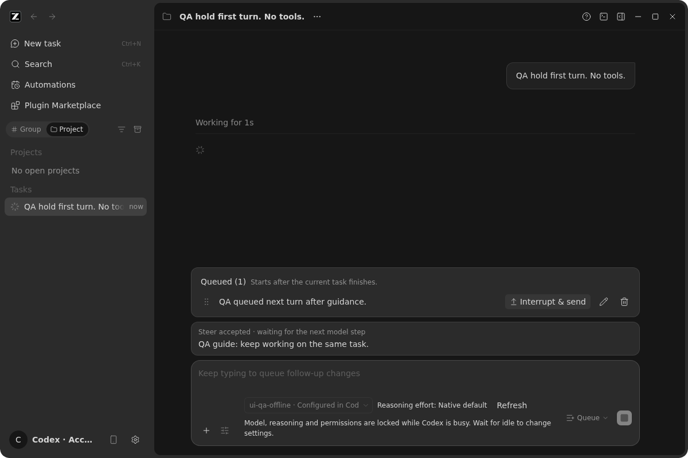
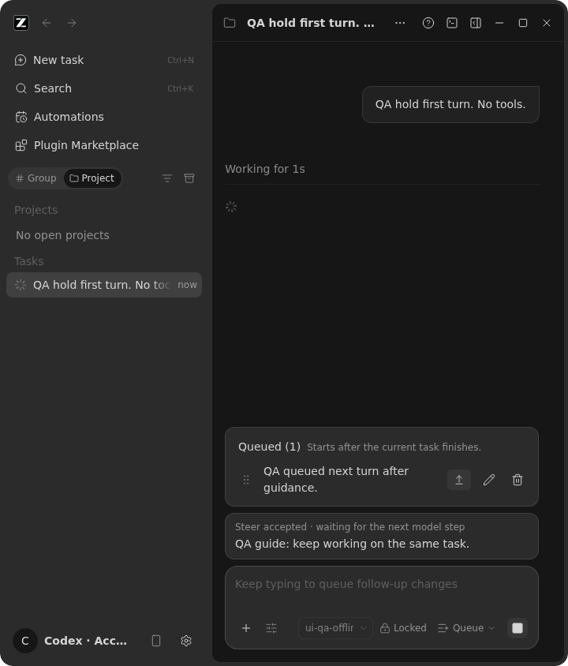
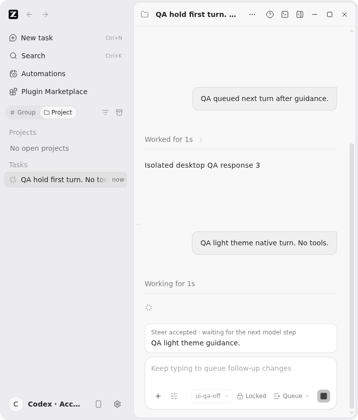

# Codex fork GUI 适配复核：运行中补充任务（2026-10-01）

本轮读取当前 Codez 与相邻 `/root/workspace/codex` 源码（相邻仓库只读），
并以隔离 Electron → Window Host → bridge → 固定原生 Codex → 无认证回环模型
进行真实界面验证。前一轮更广的适配边界见
[Codex 适配复查](codex-adaptation-audit-2026-10-01.md)。这里的回环模型不能
代替真实账号、手机远控、跨系统构建或外部插件安装。

## 有证据的结论与优化优先级

| 优先级 | 已确认事实 / 待验证推断                                                                                                                         | 处理                                                                                                                                       |
| ------ | ----------------------------------------------------------------------------------------------------------------------------------------------- | ------------------------------------------------------------------------------------------------------------------------------------------ |
| 高     | Codex 桌面的旧“交互行为”设置被隐藏；此前运行中只能普通排队或组合键抢占，`turn/steer` 虽有桥接协议却无可发现 GUI 入口。                          | 已修：Composer 运行中显式选择一次性的“排队 / 引导”，默认排队；拒绝保留草稿与选择，成功重置。                                               |
| 高     | Codex `turn/steer` 收下的内容在注入前不进入 `thread/queue/list`；把队列投影当作等待中的引导会漏显。真实消息出现后也不一定有通用 `guided` 标记。 | 已修：ACK 后展示明确标注的本窗口临时提示，仅以本次命令 ID 与原生 `userMessage.clientId` 的投影对应；同一轮真实消息出现即让位，切轮即消失。 |
| 高     | 720px 窗口的只读模型详情曾把发送方式/停止按钮挤出可见区域；最初的临时提示标题也被队列卡片负间距覆盖。                                           | 已修：运行中模型信息在紧凑宽度收成可读的“已锁定”状态；可交互控件保留空间，Codex 队列和输入框改为独立卡片层。                               |
| 中     | 原队列卡片使用“Codex 原生队列/恢复后也生效”等实现用语，单行截断正文；“立即发送”没有说明会打断当前任务。                                         | 已修：人数能理解的数量、执行时机、两行正文与“打断并发送”说明。                                                                             |
| 待验证 | 本容器 inotify 实例上限为 128；新旧真实 Electron `page.reload()` 均出现 renderer `exitCode=133`，Main 曾触发有界重载。                          | 不把浏览器夹具通过冒充 Electron 崩溃恢复通过；需在资源正常的宿主机重测并定位 native 崩溃。                                                 |

### 状态所有权与事件顺序

```text
运行中用户输入 → Composer 一次性选择（只拥有草稿）
  → Window Host owner/lease 路由 → bridge sendText(requestedDelivery)
      ├─ queue → Codex thread/queue/add → 原生 queue/list → 可编辑队列卡片
      └─ guide → Codex turn/steer → ACK commandId → 本地“已接收、待生效”
                                         ↓ 下一次模型步骤
             原生 userMessage.clientId → bridge sourceCommandId → 同轮消息替换本地提示

桌面：既有 continuous 订阅；手机：既有 replayable snapshot/gap repair；
原生 Codex 是唯一接纳队列与会话事实的所有者。
```

组件实现复用现有 Host 命令入口，没有增加 Renderer 已接纳队列、Main 业务状态或新远程会话。
等待提示是暂态本窗口提示，不表示 Codex 提供了可编辑或持久的 guide 队列；
按 `workspaceIdentity?.trim() || workspacePath` 与 session/turn 一起隔离，
刷新后只能显示原生确实投影过的历史。

### 界面证据

正常窗口下，两类等待中的输入卡片分开表示：



真实隔离 Electron 的 720px 深色和通过“外观”页面选出的浅色：




原始问题截图及复现步骤留在本地
`.tmp/codex-dogfood-followup-20261001/report.md`（仓库忽略目录）。
录屏器在本容器报 `ffmpeg write failed: Broken pipe`，不宣称存在有效视频。

## 已执行验证（与仍未执行的场景分开）

- 根目录 `pnpm build:bootstrap`、`pnpm typecheck` 通过；`pnpm lint` 0 error、70 条既有 warning；
  `pnpm architecture:check --changed` 0 新违规。新增导出/引用均位于原有 UI
  层与 Codex bridge 协议边界内。
- 新增纯函数回归覆盖 Queue/Guide 路由、命令 ID 对账、同文案多条、切会话/轮清理。
  `desktop-followup-check.mjs` 的 9 项用真实 native/Host/GUI 验证：默认排队、引导、
  反向修饰键、排队计数/打断说明、窄窗深色/真实浅色、分步放行后同轮引导
  替换临时卡片、下一轮才自动出队。最新运行结果位于
  `/tmp/codex-ui-followup-QcjlG0/`。
- 原有 `desktop-conversation-check.mjs` 的 10 项通过：首次图片、运行中权限门禁、
  `/plan` 拒绝保留草稿、队列编辑/删除/图像自动执行、Ctrl 发送和队列项的两条
  抢占路径；`/tmp/codex-ui-desktop-conversation-8T4zRE/`。
- `desktop-retry-check.mjs` 4 项通过，真实原生 503 重试和下一轮状态清理；
  `/tmp/codex-ui-desktop-retry-SyDl19/`。`desktop-interrupted-turn-check.mjs` 4 项
  通过，停止后继续及历史清理；`/tmp/codex-ui-interrupted-turn-BubY16/`。
- React 交互夹具 30 项通过，`pnpm test:codex` 桥接与发行套件通过，另运行的
  service + remote 部署 21 项通过。这些夹具是补充验证，不等同真实登录/移动设备。
- 真实 `desktop-check.mjs` 在本容器 `page.reload()` 期间失败：
  `/tmp/codex-ui-desktop-check-Y1GPll/`，Main 日志有
  `inotify_init() failed: Too many open files`、renderer
  `reason=crashed exitCode=133`，随后发起
  第一次有界重载。当前证据仅说明环境资源告警与崩溃同现，不能证明唯一根因。
- 全库 `pnpm fmt:check` 仍被 6 个未修改文件的格式问题挡住；本次文件单独检查
  通过。pnpm 10 对旧 `package.json.pnpm` 字段的警告及当前 Node 24.14.1
  与 `mise.toml` 的 24.14.0 差异均未伪装为通过的安装基线。
- 提交后首轮 GUI 复测曾误接前一只还占着相同 CDP 端口的隔离窗口：
  新回环 mock 的请求数始终为 0，而页面显示旧隔离目录的历史。这是 QA
  环境串线，不是本次产品回归通过或失败的证据。随后补上 probe 的端口
  已占用即拒绝启动校验，单测覆盖占用→拒绝与释放→准入，并用实际占用端口
  验证在创建隔离目录前就报错；释放旧端口后由新探针 `/tmp/codex-ui-qa-RBnlWS/`
  运行的 9 项 GUI 检查全部通过。

## 尚需产品/环境决策，不能宣称“完美”

1. Catalog 的 GUI 整文件写入/删除与外部 Codex/编辑器并发改写存在丢失更新风险；
   应选择原生条件写入作为唯一权威，或在迁移后收回无原子保障的 GUI 改写入口。
   这不是“再读一次”能消除的竞态（细节见前轮审查）。
2. 既有 spec 把空 `config/batchWrite` 当热刷新，但当前共享校验拒绝空 edits；
   需要在固定 native 版本确定受支持的刷新协议，或把界面改为“新线程/重启后生效”。
3. 真实 ChatGPT/API key 登录和审批、外部插件/OAuth、手机断线重放、跨 Host
   owner/lease、Windows/macOS 原生渲染、长时间冷启动和上述 Electron 崩溃恢复，
   仍需要隔离账号、真实设备与资源正常的宿主机覆盖。不能将“GUI 每个行为”
   说成已完成；也不能因为这轮多项夹具通过就替代这些验收。

子代理的只读代码审查提醒了未跟踪新文件需显式暂存（提交前执行）和组件直接
测试不足；新增的真实浏览器路径验证了菜单指针与键盘操作。审查还推断紧凑
模型容器可能溢出，已用 720px 深/浅色截图及实际 Electron 窗口缩到仓库
`MIN_DESKTOP_WINDOW_WIDTH=480` 的自动收侧栏路径复核；这条推断在有真实
resize 事件的桌面路径未复现。专用 architect 角色在当前环境因模型不存在
未能启动，备用代理收到不可解读的任务载荷；不冒称取得独立架构 CLEAR。
