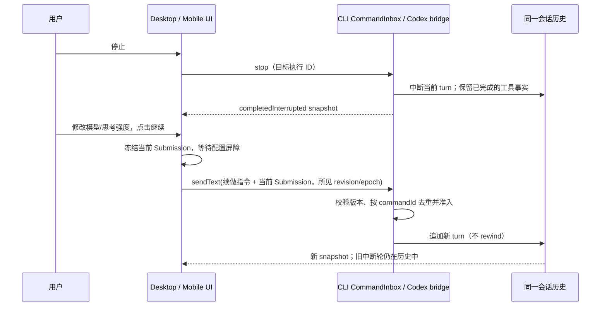

# 中断轮的「继续」：保留上下文，提交新的模型请求

Status: 2026-10-07 修订。替代原先把「继续」实现为 `retryTurn`（回滚并重发原 prompt）的规则。

## 产品规则

- 停止只中断当前在途模型请求；此前同一对话中已完成的消息、工具调用和工具结果属于会话历史，不得因「继续」被截断。正在执行的工具可能被取消，不保证从工具调用内部恢复。
- 「继续」只在最后一轮已中断且会话可写时显示。点击后在**同一 session/thread** 追加一条简短的续做请求，通过正常 `sendText` admission 启动新 turn；不调用 `retryTurn`、`thread/revert`、`rewindConversationToMessage`，不重发原始任务描述。
- 续做请求要求模型利用既有对话与已完成的工具结果，从未完成的部分接着做。新请求使用点击时 Composer 所选的模型、思考强度和模式；提交前冻结这次选择，不能退回停止时的配置。
- 原中断轮保持可见；新 turn 的 userInput 与回复正常进入历史。普通用户的重试/编辑行为仍可使用既有 `retryTurn`/`editUserQuery` 的回滚语义，不由「继续」触发。
- 只读分享、writer-conflict、selection-side chat 不显示入口。正在执行或历史中的中断轮不显示入口；停止后的按钮在桌面及手机 Web 上均常显。
- 暂停队列存在时保留队列，不清空；使用既有 `keepQueueAndSend` 和队列 ID 校验。模型未就绪、配置无效、目标已改变或命令被拒绝时保留历史和用户选择，不自动重发另一个 commandId。

## 所有者、接口与顺序

Codex 原生 thread / Codez CLI runtime 的 transcript 是各自的唯一上下文事实源；UI 只持有尚未提交的 Composer 配置，不缓存工具结果。复用 `sendText` 协议和现有 CommandInbox / Codex bridge admission，不新增一条持久化路径。

- `baseRevision`/`baseLogEpoch` 约束该按钮的提交：命令进入 owner 时若会话已改变，返回 stale；不能把晚到的「继续」排队到别人的新 turn 后。普通 `sendText` 不改变既有的无 CAS 发送语义。
- 桌面使用 continuous 实时快照，手机使用 replayable 快照与重放；两端均只从同一 owner 的历史推导按钮状态。ACK 丢失或重连时通过 commandId 查询结果，绝不自动创建第二次请求。
- `thread/resume` / `session/resume` 是会话加载，不是本操作的重新执行；中断轮的已完成工具事实必须在冷恢复后仍可见。

## 验收

1. 同一任务完成多次工具调用后手动停止，点击「继续」：不回滚、不中断历史，先前工具及结果仍可见；新请求明确基于这些事实续做，不从原始任务重跑。
2. 停止后切换模型及思考强度，再点击「继续」：新请求使用当前选择，旧工具历史不变。
3. 连点、旧窗口迟到命令或另一端先发新 turn：至多准入一次有效续做，过期命令不误杀或排到新 turn 后；普通发送仍遵循原有队列规则。
4. 中断/正常完成/运行中/历史中断轮及只读场景的按钮可见性符合上述规则；手机重连后与桌面一致。
5. 未完成工具可被取消，但已完成工具结果不得因本操作丢失；发送失败不再自动重发。原 `retryTurn` 的回滚测试仍通过。

## 验证入口

- `packages/ui/src/v4/conversationTurnContinue.test.ts`：最后一轮入口裁决。
- `packages/codex-bridge/test/commands.test.ts`：新 turn 不触发 `thread/revert`、历史保留、选择透传。
- `packages/ui/src/settings/codex/qa/desktop-interrupted-turn-check.mjs`：隔离桌面真实交互；手机 replayable 需覆盖同一场景。
- `pnpm typecheck`、`pnpm lint`、`pnpm architecture:check --changed`。
