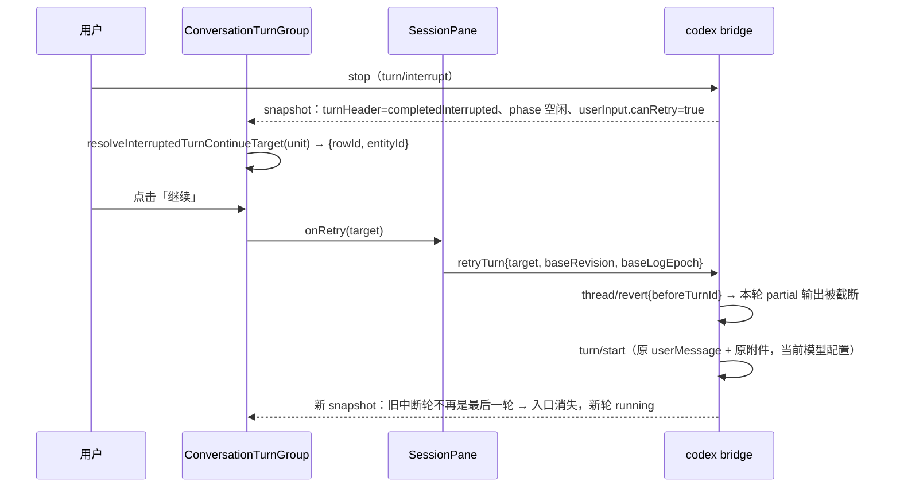

# 中断轮的「继续」恢复入口（retryTurn）

Status: 实现于 2026-09-28。修复「运行中 turn 被手动停止后，会话进入
completedInterrupted，但界面没有任何恢复入口」的问题。

## 问题与根因

- 手动 stop 后 codex bridge 把 native `turn.status === "interrupted"` 投成
  `turnHeader.state === "completedInterrupted"`，`control.phase` 同步收口为
  `completedInterrupted`（`packages/codex-bridge/src/projection.ts`）。
- 协议层 `retryTurn` 已实现且语义就是本入口需要的：`thread/revert {beforeTurnId}` 截断本轮
  → 用该轮原始 `userMessage`（含原附件）重新 `turn/start`
  （`packages/codex-bridge/src/commands.ts`）。
- 断点在 UI：产品侧只把 retry 入口挂在 assistant 行的 `actions.canRetry`
  （`ConversationTurnGroup` 的 `canRetryLatestAssistant`），而 bridge 空闲态把
  `canRetry` 打在 **userInput 行**、assistant 行只给 `canFork`
  （`packages/codex-bridge/src/bridge-snapshots.ts`）。于是 codex runtime 下中断轮末尾
  没有任何可点入口，用户只能把原 prompt 再打一遍。

## 所有权与边界

```text
codex bridge（唯一事实源：row.actions.canRetry / turnHeader.state）
  → v4 conversation snapshot 帧
  → packages/ui conversationTurnContinue（唯一裁决点：本轮能否继续、继续的目标行）
  → ConversationTurnGroup（轮尾渲染位置）
  → ConversationRowView.ConversationTurnContinueAction（按钮本体）
  → SessionPane.handleRetry → dispatchCommand("retryTurn", {target})
```

- 不新增协议字段、不改 bridge/CLI 投影；UI 只消费既有 `actions.canRetry` 与 `retryTurn`。
- 状态所有者仍是 bridge 的 thread 投影：UI 不缓存「已中断」判断，不维护第二份可重试队列，
  也不用 pane phase 造第二套 guard（与 `SessionPane.retryActionsEnabled` 注释同一约束）。
- legacy CLI runtime 无需改动：它的投影把 `canRetry` 打在最新 assistantText 行，
  同一个裁决函数自然命中；`canRetry` 缺席时入口不出现，不产生必然被拒的按钮。

## 产品规则

1. 出现条件（全部满足）：
   - 该 turn 是时间线最后一轮且非 running；
   - 该轮终态为 `completedInterrupted`（`turnHeader` 权威；冷恢复尾窗缺 header 时回退
     `workStatus.state === "interrupted"`，与 `resolveTurnRunning` 同一套降级）；
   - 本轮存在 `actions.canRetry === true` 且带 `entityId` 的行；
   - 宿主注入了 `onRetry`（`SessionPane.retryActionsEnabled`：非只读、非 writer-conflict
     只读、非分享侧聊、有 sessionId）。
2. 不出现：`completedSuccess` / `failed` 轮；非最后一条历史中断轮；分享只读时间线。
3. 点击语义：截断当前轮 partial 输出，从原 user prompt 重新执行整轮；**不是**从停止的字节处
   续写。停止后改过的模型/配置对重跑生效——`retryTurn` 读当前会话配置，不快照停止时的配置。
4. 只允许最后一轮：bridge 的 revert 以 `beforeTurnId` 截断，指向历史中断轮会连带丢弃其后
   所有轮次，因此 `isLastTurn` 是硬门，不是视觉取舍。
5. 入口常显（不进 hover-only 动作栏）：它是中断后唯一的恢复路径，且手机远控没有 hover。

## 目标行选择（唯一裁决点）

`resolveInterruptedTurnContinueTarget(unit)`：

- 候选顺序：本轮 `realUser` userInput → 其它 userInput → assistantText，全部按 CLI row 全序；
- 只接受 `actions.canRetry === true && entityId` 非空的行，命中即返回 `{rowId, entityId}`；
- 无候选返回 `undefined`（入口不渲染），不猜行、不降级成 `editUserQuery`。

## 事件顺序



- 幂等边界：命令带 CAS `baseRevision`；重跑期间 `phase === "running"` 使 `canRetry` 缺席，
  入口自然消失，连点不会并发提交第二轮。
- desktop continuous 与 mobile replayable 共用同一份 snapshot 投影，两端语义一致。

## 验收场景

1. 手动 stop 后，中断轮末尾出现「继续」按钮；正常完成的轮不出现。
2. 点击后原轮 partial 输出被截断，新 turn 从原 prompt 启动。
3. 停止后切换模型再点「继续」，新轮使用切换后的模型配置。
4. 历史中断轮（其后已有新轮）不出现入口。
5. 只读分享时间线、writer-conflict 只读会话不出现入口。
6. `pnpm typecheck` 与 `pnpm lint` 通过。

## 合同与限制

- 与队列恢复入口（`TID_V4_QUEUE_RESUME` / `chat.queue.resume`）是两件事：那是 autoDrain
  暂停后继续消费队列，本入口是重跑被停止的那一轮。
- 按钮 test id 复用既有 `TID_V4_RETRY`（`v4-retry-<rowId>`），rowId 是目标行的 rowId。
- `retryTurn` 被命令层拒绝时沿用 `SessionPane.handleRetry` 既有 warn 日志，不新增兜底分支。
