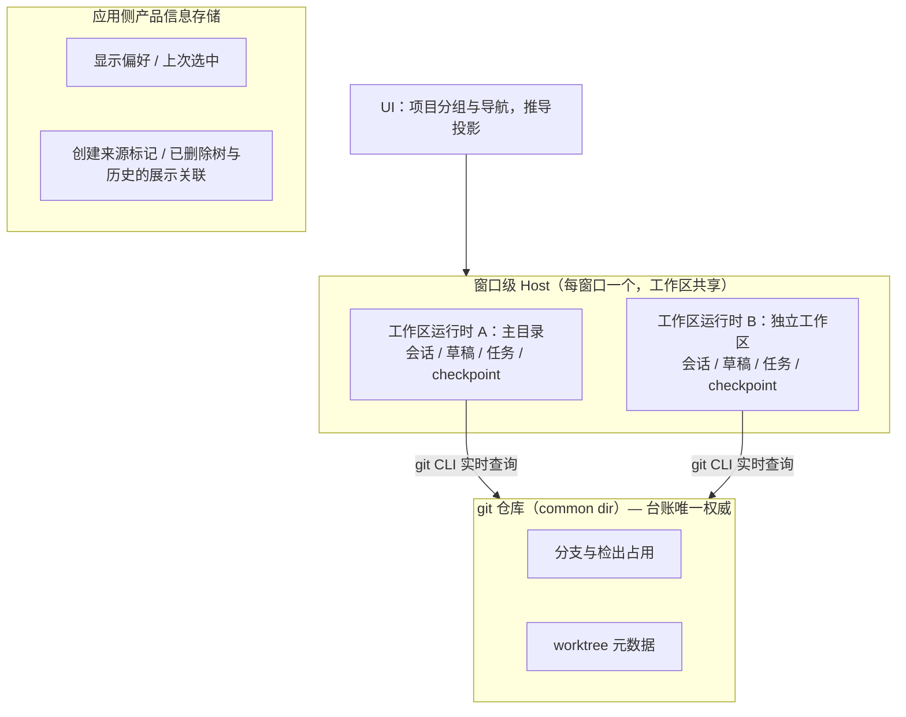

# Git Worktree 独立工作区：项目分组、并行会话与安全清理

## 背景

当前应用的工作区模型是平的：一个文件夹就是一个工作区，会话、历史、身份全部挂在
路径上。Git 读链路（状态、分支、diff、提交图、自动刷新、checkpoint）经实证在
linked worktree 下可用，但 GUI 层存在缺口：没有 worktree 创建/管理能力、分支
切换器不标注检出位置、同一仓库的主目录与多棵 worktree 在侧栏里互不相干。

本方案要回答的用户问题不是"怎样管理 worktree"，而是：

> 我想让两个任务同时做，别互相改乱文件；我能随时找到它们；做完以后，知道怎么把
> 成果用起来，也不怕清理时删错东西。

底层保留"项目 → 工作树 → 会话"的三级数据关系，面向用户则组织为"我要做什么、
在哪份代码里做、做完怎么使用成果"。产品名词用**独立工作区**（辅助说明"基于
Git worktree"），不用"环境"——worktree 与主仓库共享分支引用与默认配置，并非
完整隔离，名词不能夸大承诺。

## 概念模型与词汇

- **项目（Project）**：推导式分组，不是一等实体。共享同一个 git common dir 的
  工作区自动聚合；无项目注册表、无数据迁移。远程场景分组 key 必须包含远端身份，
  不能只按路径匹配。
- **工作区 / 独立工作区（Workspace）**：项目的执行面。仓库主目录天然是项目的
  第一个工作区；linked worktree 是后续工作区。会话、草稿、运行中任务、
  checkpoint 的归属保持现状——全部属于工作区这一层。
- **会话（Session）**：归属于创建它的工作区。项目视图与任务列表可以跨树只读
  聚合：看得见、能跳转；不存在"把会话移动到另一个工作区"的操作。
- **检出（checkout）**：git 台账事实，唯一权威是 git 本身。分支是否被占用、被
  哪个工作区占用，必须在动作发生的瞬间实时查询 git；检出状态随时可能被终端或
  其他工具改变，不允许用 Codez 的会话记录推断。

## 状态所有者



- 窗口级 Host 由同一窗口内各工作区运行时共享；不为每棵树引入独立 Host 进程。
- 项目分组是 UI 层的推导投影，不落存储，不成为任何状态的所有者。
- worktree 写操作（创建/移除）经当前工作区 Host 上的 Git 服务执行，元数据由
  git 自己落在 common dir，应用不另建 git 台账的副本。
- 应用侧只保存产品信息：显示名称、上次选中、折叠/隐藏偏好、创建来源标记、
  已删除工作树与历史会话的展示关联。**来源标记缺失或读取失败时，一律按"用户
  手工创建"处理，清理行为保持保守**——标记失败只允许降级到更谨慎。

## 身份与分组

三种身份各有用途，不得混用：

| 身份                                        | 用途                               |
| ------------------------------------------- | ---------------------------------- |
| 来源作用域 + common dir                     | 项目分组                           |
| 来源作用域 + 树根                           | 工作树发现条目去重                 |
| 现有 `workspaceIdentity \|\| workspacePath` | 会话、草稿、运行时归属（保持不变） |

- **来源作用域**：稳定的本地/远端文件系统身份。本地为常量；远端取 RemoteTarget
  的 authority 段（ssh host/port/user、wsl distro/user、docker container）。构造
  与解析统一走共享身份工具模块（remote-workspace-identity），UI 不手工拆字符串；
  该模块需补充作用域构造能力（现有解析工具刻意不透出 authority）。**禁止**使用
  窗口 Host 实例 ID、`remoteSessionId`（每次连接重新生成）或完整
  `workspaceIdentity`（含路径，会把同仓库的树拆开）作为分组作用域。
- 同一远端断连重连后项目不换组；不同远端出现相同 common dir 字符串不合组；来源
  身份不足时不猜测合组。
- common dir 由执行 Git 的宿主端规范化后提供给 UI；UI 不按本机路径规则处理远端
  路径。旧服务未返回字段、非 Git 或查询失败时，不汇入任何"空 common dir 项目"。
- 子目录工作区：归入项目不改变其 workspacePath、身份、草稿与历史归属；同一棵树
  下打开多个子目录仍只是一棵工作树，不计为多个独立工作区；只打开子目录时树根
  不标记为"已打开"，发现条目明确"打开仓库根目录"；树根已打开时跳转已有实例，
  不重新创建草稿。发现与打开一律以树根为粒度。

## 用户入口与导航

- **R1 保留默认操作，独立工作区按需选择**：普通"新建会话"主按钮、快捷键与
  桌面菜单保持既有的一步新建草稿行为及目标工作区解析规则；不先弹选择菜单、
  不要求确认、不自动创建或切换工作树。当前工作位置本身是 linked worktree 时，
  仍在该位置新建，不回到主目录。工作树能力不得增加普通新建的点击次数。
  主按钮旁的独立下拉箭头提供额外入口；只有显式点击箭头才展开菜单，箭头点击
  不得冒泡触发主按钮的新建动作。菜单常驻三项——
  - 当前工作区（默认，与这里的其他会话共用文件）；
  - 新的独立工作区（单独的代码目录，适合并行任务；展开后配置起始分支——新分支
    或空闲的已有分支——以及保存位置，位置默认折叠但可见）；
  - 已有工作区…（列出本项目其他工作区，跳转复用，不重复创建）。
    独立工作区选项不是新的全局默认值；上次选择该选项不得改变下一次普通新建的
    行为。新增菜单的展开状态属于 UI 局部状态，既有 root actions 继续拥有普通
    新建的目标解析与草稿操作，不新增另一条默认新建路径。
- **R2 入口常驻、复杂度按需出现**：分支菜单提供主要入口，与“新建分支…”并列显示
  “新建独立工作区（工作树）…”和“打开已有工作区…”（第二批起「打开已有工作区…」
  收敛至工作区切换器，见 [git-worktree-removal.md](git-worktree-removal.md) IA3）。新建分支仍只在当前目录创建
  并切换分支，不隐式创建工作树；工作树创建也可使用空闲的已有分支，不藏在新建
  分支弹窗内。草稿页与会话页的分支菜单使用同一入口。原新建会话菜单保留为辅助
  入口（能力不可用时
  禁用并附说明，见 R15/R16）；工作树能力不可用不得额外禁用普通新建主按钮或
  拦截快捷键。工作区切换、分组等导航界面在出现第二个工作区后才显示。隐藏暂时
  用不到的复杂界面，不隐藏开始使用的入口。
- **R3 非阻塞并发提示**：当前工作区有运行中任务时，新草稿输入框附近显示共用
  文件的风险提示与"使用独立工作区"入口，使用户发送前可见；不通过弹窗、必选项
  或额外确认拦截普通新建、增加点击次数。提示只使用已有可靠运行状态，不为查询
  状态启动未打开工作区的运行时，也不擅自改变草稿归属。
- **R4 任务优先的日常导航**：会话列表默认按任务标题组织，工作区作为标签与筛选
  条件，不强迫用户沿"项目 → 工作树 → 会话"三级寻找任务。运行中、等待确认的
  任务必须浮出可见，不藏在切换器深处。会话页与输入框附近持续显示当前工作位置
  及本地/远程标识。切换工作区时各自草稿独立保留，未发送内容绝不改投另一个
  目录。（本条的列表形态为交互方向，需原型验证。）
  跨工作区任务列表遵守与 R5 相同的边界：只使用已有会话索引、缓存与已连接运行时
  提供的信息；不得为补齐预览或查询状态而启动未打开工作区的运行时；没有可靠信息
  时显示"尚未加载"或"状态未知"，不得显示为"没有历史"或"当前空闲"。
- **R5 主动发现**：从任一已打开工作区经 `git worktree list` 发现仓库已登记的
  其他工作树。主动发现只更新发现列表：当前未打开的工作树（包括从未打开及曾
  打开后关闭的）均以轻量条目呈现；发现、刷新、展开菜单及读取展示信息，不得
  隐式注册活跃工作区、挂载工作区运行时或建立新的远程连接；用户显式打开后，
  才经现有能力、信任与权限流程激活。发现所需的 Git 查询可经由当前已连接 Host
  执行。发现项可出现在"其他工作区"菜单中，不自动变成展开的活跃侧栏条目。
  显式打开按意图区分，复用完整打开语义而非底层调用的直接拼接：
  - 已打开 → 激活已有工作区，保留会话、草稿和布局，不强制进入新草稿；
  - 未打开 → 校验打开能力与目标身份后，复用既有本地/远程打开流程；
  - 用户明确"在这里新建会话" → 才进入新建草稿流程。
    远程条目必须解析为自己的目标身份（RemoteTarget + 工作区上下文），不沿用来源
    树的身份或绑定。不新增底层打开机制：打开意图适配、能力门控、目标身份与重复
    打开保护集中在 root actions 一处。
- **R6 占用可见**：分支列表携带每个本地分支的检出位置，被占用的分支在选择界面
  直接标注所在工作区，替代点击后才报错。

## 创建流程与可用性

- **R7 创建前透明**：确认创建独立工作区前，界面明确显示——起始分支与基线提交；
  未提交修改与未跟踪文件不会带入新目录（第一版不提供带入，必须说明）；新目录
  的位置（默认约定位置，可折叠查看，不隐瞒）。
- **R8 分步执行与失败恢复**：创建链路分步——创建或复用工作树 → 检查工作区可用
  性 → 打开新草稿并明确显示工作位置 → 用户发送。中途失败保留用户输入与已完成
  步骤，允许针对失败步骤重试；不得把后续步骤失败（如工作区连接失败）显示为
  整体"创建失败"导致用户重试后残留多个目录。未经用户明确授权，不复制 `.env`
  等本地配置，不执行初始化脚本；依赖未准备、配置缺失与目录创建是不同状态，
  分别呈现。
- **R9 占用冲突**：选择"基于已有分支"时实时查 git 台账。分支空闲则建树；已被
  占用则不强行创建，提示占用所在工作区，提供"跳转到该工作区"与"从该分支拉一个
  新分支"两个选择。
- **R10 约定位置**：应用创建的工作树放在统一约定位置（默认仓库同级目录）并使用
  可预测命名；约定用于默认体验与识别提示，**不作为删除权的证明**（见 R13）。

## 成果出口（第二阶段必须包含）

- **R11 完成后的明确出口**：独立工作区中的任务完成后，用户能够——查看相对选定
  基线的改动；明确成果所在分支与未提交改动；接续现有提交、推送或 PR 工作流；
  在"保留工作区 / 关闭工作区 / 安全清理"之间做出知情选择。第一版不做 GUI 合并
  与冲突解决，但必须直说并提供清晰指引，不允许用户"做完不知道成果在哪"。

## 生命周期与清理

- **R12 三个动作明确分离**：

  | 动作                    | 承诺                                               |
  | ----------------------- | -------------------------------------------------- |
  | 关闭工作区              | 不删除代码目录，不删除历史；仅移除入口并释放运行时 |
  | 删除独立工作区          | 删除明确列出的目录；默认保留分支与会话历史         |
  | 删除分支 / 删除会话记录 | 各自独立操作，不随上述动作附带执行                 |

- **R13 物理删除的专属安全流程**（v1 落地批次见 [git-worktree-removal.md](git-worktree-removal.md)）：不得复用"关闭工作区"的确认替代。删除前——有
  运行任务先停止并确认结束，然后重新检查；展示未提交改动、未跟踪文件与需要
  关注的本地配置文件；检查失败或远端断连时按"风险未知"处理，不当作"没有风险"。
  删除权依据 git 台账实时事实（属于该仓库、非主目录、未锁定）而非目录命名约定；
  来源标记只用于清理提示的差异化展示——v1 不读取标记，全部工作树统一执行最
  保守的完整确认流程（即"标记缺失按用户创建处理"的最谨慎档），未来批次可用
  标记对 Codez 创建树简化文案，但不得降低任何安全检查。删除后会话历史保持
  只读可访问；从历史尝试"继续执行"时，明确说明需要先恢复工作位置。
- **R14 可访问性与保护状态是两个独立维度**：
  - 可访问性：可访问 / 不可访问 / 未知——决定能否打开、是否提供重试。
  - 保护状态：已锁定 / 未锁定——`git worktree lock` 防止工作树元数据被清理
    及树被移动或删除，不代表目录不可访问。锁定的工作树显示"受保护"并展示锁定
    原因，仍允许正常打开使用；锁定只影响清理限制。
  - 不可达时先提供重试、检查位置或修复，区分"暂时不可访问"（未挂载、远端断连）
    与"已确认删除"；清理前显示实际影响范围；`git worktree prune` 是仓库范围
    操作，不得包装成"删除当前这一行"的错觉。

## 平台能力矩阵

- **R15 能力分端声明**：按 桌面本地 / 桌面远程已接入 / Web 服务端 / Web 远控
  各自声明 查看 / 切换已连接工作区 / 创建独立工作区 / 删除 的支持状态。不支持
  的操作呈现明确文案（如"此连接暂不支持该操作"），禁止点击后无响应或假死。
  能力缺失一律视为 unsupported 并隐藏或禁用入口，不从命令错误串推断。

## 非 Git 工作区

- **R16 无错误降级**：非 Git 工作区下，本特性在任何路径上不产生错误。"新的
  独立工作区"入口常驻但禁用，附一行说明（"此工作区不是 Git 仓库"）；git 不可用
  （未安装/不可用）与"不是仓库"区分文案。分组、切换器等导航元素对非 Git 工作区
  不出现。不提供"复制目录"式的伪隔离——脱离 git，分组、占用判断与成果出口
  全部失去语义基础。"初始化为 Git 仓库"是独立功能决策，不在本 spec 范围。

## 接口面（契约级）

- Git 服务新增：worktree 列举（检出分支、路径、锁定/失效标记）、创建（新分支或
  空闲已有分支）、移除；分支列表契约扩展检出位置。已有 `linked-worktree` 识别
  从迁移专用 fail-open 语义提升为正式契约语义。
- 工作区列表投影携带推导出的项目分组 key；分组不持久化。
- RPC 版本容忍：远端旧版本 server 无新能力字段时视为 unsupported（遵循
  codex-desktop-capabilities 既有约定）。
- 远程工作区：建树/删树经现有 Host 通道在远端执行；路径与平台差异走既有依赖
  注入，不在业务代码手写远程路径格式。

## 实现约束（阶段一）

- ① services/git 提供 Git 事实（common dir、worktree 列表、分支占用）；② UI
  派生发现列表与项目分组，不写活跃工作区注册表（tabStore）；③ root 层复用完整
  打开语义；④ 不改变 Host 与运行时生命周期架构，且必须验证发现链路没有隐式
  触发它。
- 实施顺序：① 契约新增 → ② 投影派生 → ③ 打开接入。
- 四类回归优先锁住：发现/刷新/预览不新增运行时或连接；切回已打开工作区不重置
  会话；远端重连不换组、同路径不同远端不混组；子目录归组不改身份、显式打开
  树根才新增对应工作区。

## 分阶段计划

### 阶段一：发现、可见性与导航（只读，无 git 写操作）

- 分组 key 推导（common dir + 远端身份）与项目分组投影。
- `git worktree list` 主动发现，切换器列出各树（含未打开树的"打开"入口）。
- 分支列表携带检出位置；被占用分支标注所在工作区。
- 任务优先的会话列表：工作区标签与筛选；运行中/待确认任务浮出；当前工作位置
  与本地/远程标识常驻显示。

> 实施批次说明：第一批交付 = 契约（commonDir / listWorktrees / 分支占用 / 作用域
> 构造）+ 投影派生 + 发现 hook + 分支占用标注；第二批 = 切换器组件挂载 + root 层
> 三意图打开接入；第三批 = R4 任务优先导航（默认任务优先视图、工作区筛选与行内
> 标签、运行中/待确认浮出层、会话页常驻位置标识）。阶段一验收 2/3/8 已在第二批
> 后端到端验证。

### 本次交付：阶段二第一批（创建闭环与入口优化）

#### 入口可发现性修订

- 用户操作链路：分支菜单 → 显式创建 / 打开意图 → shell 现有创建控制器 / root
  actions → 原有服务与生命周期。菜单展开仅刷新只读信息，不新增工作区或草稿。
- `WorkspaceShellLayout` 仍是创建对话框与发现投影的唯一所有者；分支菜单通过
  UI context 获取命令和展示信息，不另建创建 hook、状态或 RPC 写入路径。
- UI context 按 `workspaceIdentity?.trim() || workspacePath` 校验消费者，身份或
  工作区不匹配时不提供操作；分屏与远端同路径不得借用其他工作区的创建控制器。
- 打开菜单即可直接看到独立工作区入口，不依赖新建任务旁的小箭头。创建能力
  不可用时显示原有禁用原因；已有条目的打开仍遵守能力门控，已打开条目允许切回。
- 验收：草稿页和会话页均可从分支菜单进入创建；取消不改变草稿、分支或活动
  工作区；普通新建任务与 Ctrl/Cmd+N 保持一步行为；普通新建分支仍使用当前目录；
  展开菜单不挂载发现树；不同 workspace identity 的菜单不能调用当前树的操作。

- 普通新建按钮、快捷键、桌面菜单沿用当前 root actions；仅增加独立的菜单箭头。
  菜单包含当前工作区、新的独立工作区、已有工作区，非 Git、断连或旧服务只禁用
  相关额外能力，不影响普通新建。已有工作区只经 R5 打开编排，不为菜单预览建连。
- 创建对话框支持新分支 / 空闲已有分支，默认以当前 HEAD 为基线。Git 服务在宿主
  端给出树根、common dir、精确基线提交与目标绝对路径；UI 不推算远端路径。
  默认位置为仓库树根的同级 `<仓库名>-worktrees/<分支安全名>-<操作ID短后缀>`，
  可修改为宿主端绝对路径；子目录发起仍创建整棵树并打开树根。
- `IGitService.previewWorktreeCreation` 是只读预览；`createWorktree` 是唯一创建
  命令。请求包含操作 ID、分支模式、分支名、已预览基线提交与目标路径。创建前
  复检基线、占用、目标目录和仓库身份；不用 `--force`，不覆盖已有目录、不复用
  非本操作创建的树、不带入未提交文件、不复制配置、不执行初始化脚本。
- Git 自己拥有工作树台账。应用侧创建操作记录存入 common dir 下的
  `codez/worktree-operations/<操作ID>.json`（不修改 Git 管理的 worktrees 记录）。
  它只记录本次操作的来源与重试信息，不是第二份 Git 台账；操作记录缺失、损坏或
  指纹不匹配时不得据此授权复用/清理。以后清理仍遵守来源缺失按用户创建处理。
- 对话框拥有表单、预览版本、步骤与错误。请求期间禁止重复提交；以操作 ID 和
  请求指纹去重。创建成功但打开失败时保留已完成结果，重试只调用打开，不再创建。
  预览过期或工作区身份变化时不自动把结果用于另一个目标；取消不改变原草稿。
  操作记录及 Git 复检允许同一操作安全重试；未知结果不得另生成目录后重做。
  结果未知时保留原确认请求并冻结编辑，不重新预览覆盖它；同来源重连后可重新绑定
  已连接的服务传输，但操作 ID、来源身份与请求保持不变。
- root actions 继续拥有激活、显式打开与新建草稿的语义；新工作树显式打开成功后
  才在其自己的 identity/path 下进入草稿。远端复用既有 RemoteTarget 建连流程，
  不沿用来源树 identity。发现和菜单展开仍不得注册新 runtime。

```text
普通主按钮 / 快捷键 → 既有 root 新建路径 → 当前工作位置的草稿
独立箭头 → UI 表单 → Git 只读预览 → 用户确认 → Git 创建/复检
                                                 ↓
                                        root 显式打开 → 目标草稿
                                                 └→ 失败仅重试打开
```

- 已有工作树切换入口同时可用于会话页，不再仅藏在空草稿里；切回保留现场。
- 本批不实现删除、合并、自动回收或初始化模板；成果出口与安全清理后续按 R11–R14
  独立交付，不以“创建完成”宣称阶段二全部完成。

### 阶段二：创建闭环、成果出口与安全清理（写能力）

- 意图优先的新建会话入口（R1–R3）、创建透明（R7）、分步失败恢复（R8）、占用
  冲突处理（R9）。
- 成果出口（R11）。
- 三动作分离与物理删除安全流程（R12–R14）；来源标记与最小产品信息存储。
- 删除后会话历史只读可读。

### 阶段三：深度整合（反馈驱动，候选不定死）

- 跨工作区会话搜索、分支时间线回顾、辅助合并与冲突处理、初始化配置模板等，
  按前两阶段真实使用反馈决定。

## 验收场景

### 阶段一

1. 同一仓库主目录与一棵 linked worktree 各打开过工作区后，UI 聚合为同一项目；
   切换器列出两棵树；从未打开过的已登记 worktree 以轻量条目出现，可显式打开。
2. 发现不激活：已打开工作区发现多棵未打开工作树；刷新、展开菜单、筛选、展示
   已有会话信息，均不新增这些工作区的运行时或连接。
3. 关闭不复活、打开不重复：关闭某工作区后再次刷新，它只作为发现项出现；显式
   打开时激活目标工作区；重复点击复用同一打开过程或已有实例，不重复创建。
4. 会话列表按任务标题组织，可按工作区筛选；运行中任务在列表浮出；会话页持续
   显示当前工作位置与本地/远程标识。
5. 分支切换器中被其他工作区检出的分支显示占用位置；空闲分支无标注。
6. 远程工作区中，路径相同但属于不同远端主机的仓库不被聚为同一项目；旧版本
   远端 server 下相关入口禁用或隐藏，其余功能不受影响。
7. 非 Git 工作区：无分组、无切换器；新建会话菜单中"新的独立工作区"禁用并附
   说明；全部路径无任何报错。
8. 切回已打开工作区只激活既有实例，会话、草稿与布局保持不变，不跳到新草稿。
9. 同一远端断连重连后，项目分组保持不变；不同远端上 common dir 字符串相同也
   不合组。
10. 子目录工作区归组后身份与归属不变；同一棵树的多个子目录计为一棵树；只打开
    子目录时树根发现条目仍显示"打开仓库根目录"，显式打开树根才新增对应工作区。

### 阶段二

11. "新的独立工作区 + 新建分支"：确认前可见起始分支、基线提交、目标位置与
    "未提交修改不带入"的说明；创建成功后自动打开新工作区并落入草稿，主目录检出
    分支不受影响。
12. "新的独立工作区 + 空闲已有分支"：建树成功。分支被占用时提示占用位置，可
    一键跳转或从该分支拉新分支。
13. 工作区可用性检查失败：已创建的工作树保留，用户输入保留，可仅重试失败步骤；
    界面不显示为整体"创建失败"。
14. 任务完成后：可查看相对基线的改动，明确分支与未提交状态，可接续提交/推送；
    可在保留/关闭/清理之间知情选择。
15. 删除独立工作区：有运行任务先停止并复检；确认页列出未提交与未跟踪文件；
    检查失败或断连时按风险未知处理；删除后该工作区会话历史只读可读，"继续执行"
    提示需先恢复工作位置。
16. 锁定但可访问的工作树显示"受保护"（含锁定原因），仍允许正常打开；目录不可达
    的工作树显示不可达并提供重试；两者均不得被直接推荐清理。
17. 来源标记缺失的工作树按用户创建处理，清理流程保持保守。
18. 默认新建不变：普通主按钮、快捷键与桌面菜单沿用既有目标解析及一步进入草稿
    的行为；无论是否发现其他工作树、工作树能力是否可用、上次是否选择过独立
    工作区，都不先弹菜单、不增加确认、不执行 Git 写操作。当前位于 linked
    worktree 时草稿仍归该工作区；有并发任务时提示在输入框附近非阻塞显示。
19. 主按钮与下拉箭头分离：点击箭头只展开菜单，不创建草稿、工作树、运行时或
    连接；只有显式选择"新的独立工作区"才进入创建配置与确认流程，取消后既有
    草稿内容和工作位置保持不变。
20. 创建安全与重试：真实 Git 证明主目录 HEAD 与未提交文件保持不变；已存在的
    非本操作目录拒绝覆盖；占用分支、过期基线、操作 ID 指纹冲突均拒绝写入。
    同一操作重复/并发提交最多创建一棵树；创建后打开失败再次重试不增加目录。
21. 导航可达：已有会话中可打开工作树切换器；只打开菜单不会挂载其他树，切回
    已打开树不清空草稿或切到新会话。手机远控无创建能力时明确禁用额外入口，
    普通新建仍保持原行为。

## 本批桌面交互回归入口

`packages/desktop/test/gitWorktreeDesktop.e2e.test.mjs` 连接显式指定的隔离 Desktop Dev
实例（`VITE_CODEZ_E2E_STORE_BRIDGE=1`，中文界面），不发送模型回合。
以 `CODEZ_WORKTREE_QA_ROOT` 指定 `/tmp/codez-worktree-qa-*` 夹具根目录，内含
`project` Git 仓库、已提交的 `tracked.txt`（内容 `base\n`）和本地 `.env`：

```bash
CODEZ_WORKTREE_QA_ROOT=/tmp/codez-worktree-qa-example \
  node --test packages/desktop/test/gitWorktreeDesktop.e2e.test.mjs
```

覆盖普通新建一步进入草稿、菜单不新增 tab、取消保留草稿、基线与路径展示、创建后
分支菜单直接创建与普通分支创建区分、自动打开、源目录不变、配置不复制、
linked tree 中默认新建不回主目录，以及两棵树
切回时分别保留草稿。第二个用例建立并展示真实空会话，验证会话页分支菜单可进入
同一创建弹窗，取消保留会话。原生配置仅写入隔离 QA home，模型地址为本机不可用
端口，不发送模型回合。远端真实网络故障与手机远控的 E2E 不由此本地夹具代替。

## 非目标

- 不做项目一等实体、项目注册表或存量数据迁移。
- 不自动回收闲置工作区；结束会话不删除工作树。
- 不支持跨工作区移动会话或运行中任务。
- 不做项目级独立设置存储。
- 不做 GUI 合并与冲突解决（阶段三再评估）。
- 不提供脱离 Git 的目录复制式伪隔离；不夹带"初始化 Git 仓库"功能。
- worktree 不构成系统级隔离边界（NOTICE.md 既有声明不变）。

## 开放问题（实现前需定）

- 后续安全清理读取创建操作记录与历史展示关联时的迁移策略（R12–R14 批次定）。
